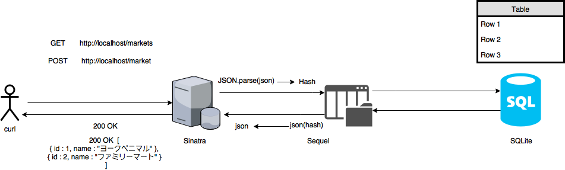

# sccp2017_final

## How2use
```
$ rake init
$ rake start 
```


## 家計簿システム



WEBサーバを作ることで家計簿システムを構築していきます。家計簿システムでは、HTTPプロトコルを介して、買い物の履歴を残したり、店舗の一覧を閲覧したり、特定の日に買った商品情報を閲覧したりすることができます。

### テンプレートの確認

```
$ rake start

# 店舗情報(market)を取得
#  最初は空
$ curl http://localhost:8080/markets
[]

# 店舗情報を追加
$ curl -X POST https://localhost:8080/markets -d {"name":"711"}

# もう一度、店舗情報を確認
$ curl http://localhost:8080/markets
[{"id":1, "name":"711"}]
```


### 家計簿システムにおけるスキーマ

家計簿システムで、具体的には「店舗」、「カテゴリ」「支出履歴」の3つのスキーマでデータ管理をおこないます。

#### 店舗(Market)

商品を購入する店舗名を保存するスキーマです。

```
Market (id, name)

例:
 market (0, "ヨークベニマル")
 market (1, "ローソン")
 market (2, "ツタヤ")
```


#### カテゴリ(Category)

商品の種類を分けるためのスキーマです。

```
Category (id, name)

例:
 category (0, "食費")
 category (1, "娯楽")
 category (2, "日用品")
```

#### 支出履歴(History)

支出履歴を付けていくためのスキーマです。

```
History (id, commodityName, amount, categoryId, marketId, month, day)
注意 - 日付は計算上文字列では面倒なので、整数型で 月日 とします (例: 1月1日 => 101, 12月31日 => 1231)

例:
 history (0, "チョコレート", 120, 0, 1, 1, 31)
 history (1, "洗剤", 450, 2, 0, 12, 25)
 history (2, "DVD", 130, 1, 2, 11, 30)
```

## Questions
1. `src/dba/market.rb` を参考に `src/dba/category.rb` を完成させよ

2. `src/app.rb` にすでに実装されている店舗情報(`market`)に関する処理を参考にして購入した商品(`category`)に関する以下の処理を追加せよ
  - `category` テーブルに購入した商品( `category` )を登録する処理
  - `category` テーブルから全てのデータを取得する処理
  - `category` テーブルから `category` のidを元に購入した商品を取得する処理

3. `src/dba/history.rb` を以下の仕様にそって完成させよ
  - 買い物での支出をとしてデータベースの `spending_history` テーブルに追加する `spend` メソッド
  - `spending_history` テーブルの全てのデータの取得を行う `history_all` メソッド

4. `src/app.rb` に支出履歴に関する以下の処理を追加せよ
  - `spending_history` テーブルに支出履歴( `history` )をデータベース登録する処理
  - `spending_history` テーブルから全支出履歴の取得を行う処理

## オプション問題
1. `spending_history` テーブルからデータを月、日を元に取得できる処理を完成させろ
  - `src/dba/history.rb` にある `get_history_by_date` を使う
  - `src/app.rb` にある `get '/history/:month/:day'` を使う
2. `spending_history` テーブルから今までの支出総額を取得する処理を追加せよ
3. 商品名( `commodityName` )毎の支払総額を取得する処理を追加せよ
4. `spending_history` テーブルから今までの支出総額を取得する処理を追加せよ
5. `category` を指定してその `category` の支出総額を取得する処理を追加せよ
6. `category` を指定してその `category` の商品一覧を取得する処理を追加せよ

